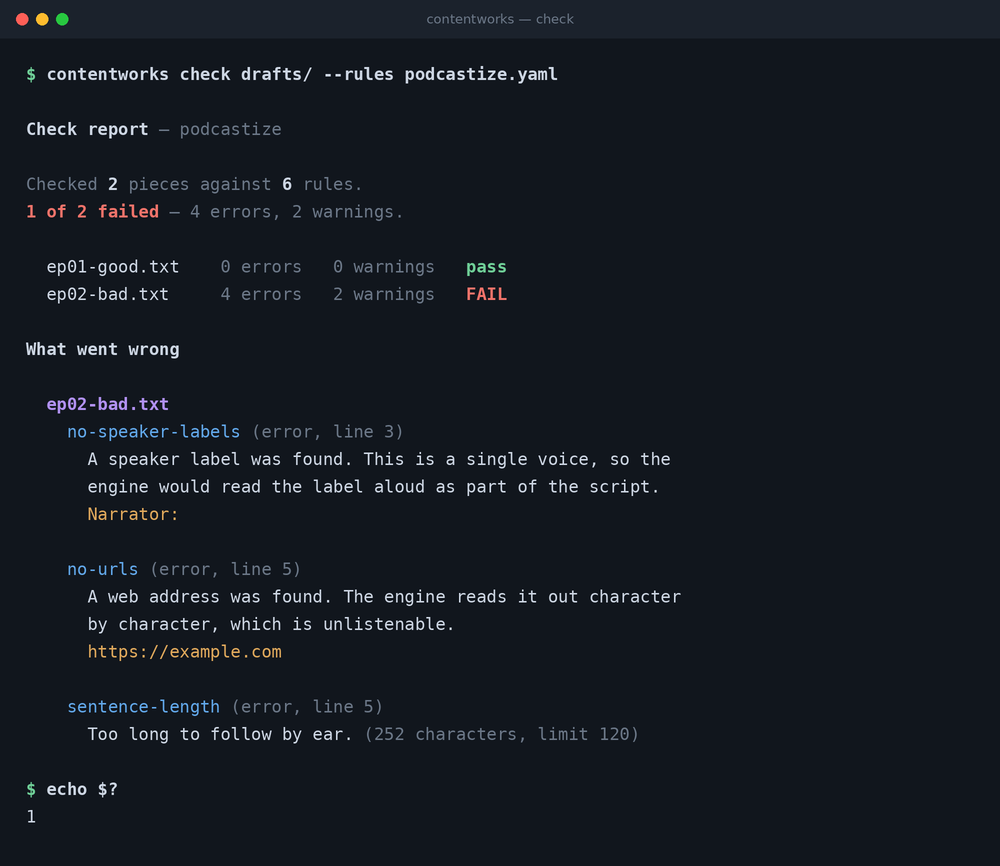
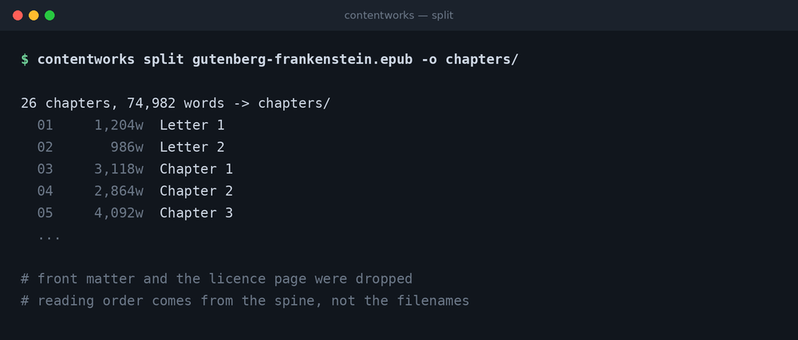
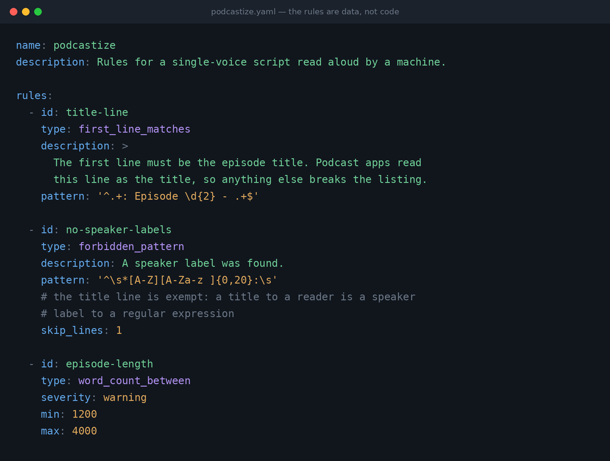
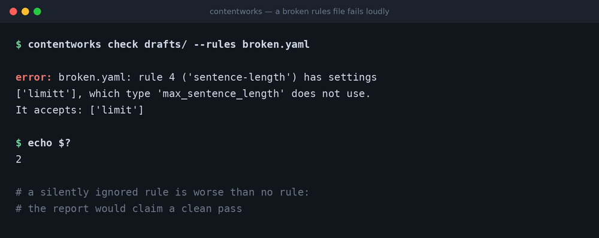

<div align="center">


# contentworks

**Turn source material into a checked series.**

Split a book into chapters, then hold every piece of writing to a set of rules —
and get told which rule broke, in which file, on which line.

[](https://github.com/eylgit/contentworks/actions/workflows/ci.yml)
[](https://www.python.org/)
[](LICENSE)
[](pyproject.toml)

</div>

---



---

## The idea

Most writing tools bury their standards in code. This one keeps them in a file:

> **The rules are data, not code.** A different kind of content means a different
> rules file — not a different program.

That one decision is what the design is for. A podcast script, a set of course
notes and a series of onboarding emails all have rules; they are not the same
rules, and none of them should require a code change.

---

## Install

Not on PyPI yet. Install from source, inside a virtual environment — recent
Python installations refuse `pip install` outside one:

```bash
git clone https://github.com/eylgit/contentworks.git
cd contentworks
python3 -m venv .venv
source .venv/bin/activate
pip install -e .
```

Python 3.10 or newer. One runtime dependency: PyYAML.

---

## Two commands

### `split` — a book into chapters

```bash
contentworks split book.epub -o chapters/
```



Reading order comes from the book's **spine**, not from the filenames — in real
EPUBs those rarely agree, and a tool that sorts by filename silently shuffles
the book. Front matter and copyright pages are dropped by default.

### `check` — writing against rules

```bash
contentworks check drafts/ --rules podcastize.yaml
```

Exits `0` when everything passes and `1` when something fails, so it drops
straight into a CI pipeline or a git hook.

---

## Writing rules



Every rule needs an `id`, a `type` and a `description`. **The description is what
a person reads when the rule breaks**, so it should say what is wrong and why it
matters — not restate the rule.

`severity` is `error` (the default) or `warning`. Warnings are reported but do
not fail the run.

| Type | Settings | What it does |
|---|---|---|
| `first_line_matches` | `pattern` | The first line must match |
| `forbidden_pattern` | `pattern`, `skip_lines` | The pattern must not appear |
| `required_pattern` | `pattern` | The pattern must appear somewhere |
| `max_sentence_length` | `limit` | No sentence longer than `limit` characters |
| `word_count_between` | `min`, `max` | Total length, in words |
| `blank_line_after` | `characters` | Each of these characters must be followed by a blank line |

Two details that came out of real use:

**`skip_lines` exempts the first N lines.** A title line can legitimately look
like the thing a rule forbids — `Series: Episode 01 - Title` is a title to a
reader and a speaker label to a regular expression. No amount of tightening the
pattern tells those apart, because the difference is *where the line sits*.

**Word counts treat each Chinese, Japanese or Korean character as one word.**
Those languages are not written with spaces, so counting by whitespace reports
`1` for an entire paragraph.

---

## A broken rules file fails loudly



A misspelled setting is rejected, not ignored. **A rule that is quietly skipped
is worse than no rule at all**, because the report then claims a clean pass.

---

## From Python

```python
from contentworks import check_text, load_rules, split_epub

chapters = split_epub("book.epub")
rules = load_rules("rules.yaml")

for chapter in chapters:
    findings = check_text(chapter.text, rules)
    if findings:
        print(chapter.title, "->", len(findings), "problems")
```

---

## How it is put together

```
src/contentworks/
    sources/     where material comes from (EPUB today)
    rules.py     load and validate a rules file
    checks.py    apply the rules to a piece of text
    report.py    turn findings into something readable
    cli.py       the command line
```

`cli.py` depends on the rest. **Nothing depends on `cli.py`.** That is what makes
it possible to add a web interface later without touching the core, and what
makes the core testable without pretending to be a terminal.

42 tests cover the parts that fail quietly: reading order, paragraph boundaries
surviving tag stripping, line numbers pointing at the right line, and every rule
type checked both ways — that it fires when it should, and stays silent when it
should not.

---

## Limits, stated plainly

- **EPUB only.** PDF and MOBI are not supported.
- **Front matter is dropped only when it is short.** Anything under 100 words
  goes. Project Gutenberg's 3,000-word licence at the end of every book does
  not, and arrives as a chapter.
- **The checks are mechanical.** They catch what can be decided by reading the
  text — patterns, formatting, length. They cannot tell you whether the writing
  is any good.
- **Sentence splitting is punctuation-based.** `Dr. Smith` counts as two
  sentences. Abbreviations are not handled.
- **`max_sentence_length` counts characters.** A limit tuned for English will be
  wrong for Chinese, and the other way round.

---

## Development

```bash
git clone https://github.com/eylgit/contentworks.git
cd contentworks
python3 -m venv .venv
source .venv/bin/activate
pip install -e ".[dev]"
pytest
ruff check .
```

---

## Licence

MIT — see [LICENSE](LICENSE).
